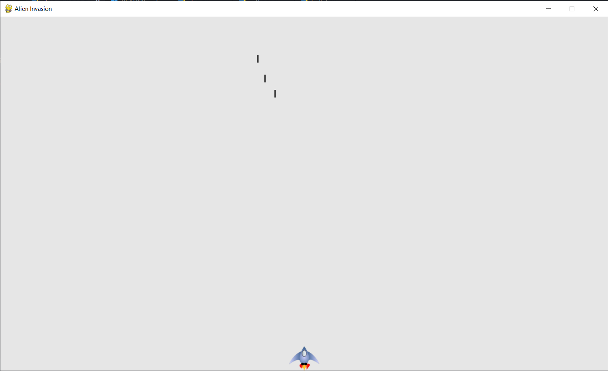
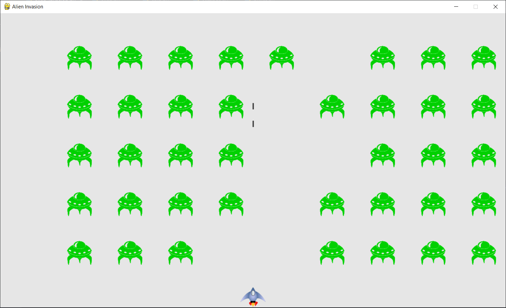

# Alien Invasion

## Description
Alien Invasion is a simple 2D space shooter game built using Python and Pygame. The objective of the game is to control a spaceship and shoot down waves of alien invaders.
...

## Description
Alien Invasion is a simple 2D space shooter game built using Python and Pygame. The objective of the game is to control a spaceship and shoot down waves of alien invaders.

## Features
- Player-controlled spaceship
- Alien invaders with different movement patterns
- Bullets to shoot down aliens
- Score tracking
- Levels with increasing difficulty
- Sound effects and background music

## Installation

1. Fork the repository by clicking on the "Fork" button at the top right corner of this page.
2. Clone the forked repository to your local machine: `git clone https://github.com/your-username/alien_invasion.git`
3. Install the required dependencies: `pip install -r requirements.txt`

## Usage
1. Navigate to the project directory: `cd alien_invasion`
2. Run the game: `python alien_invasion.py`

## Controls
- Use the arrow keys to move the spaceship
- Press the spacebar to shoot bullets

## Contributing
Contributions are welcome! If you find any bugs or have suggestions for improvements, please open an issue or submit a pull request.

## License
This project is licensed under the [MIT License](LICENSE).
