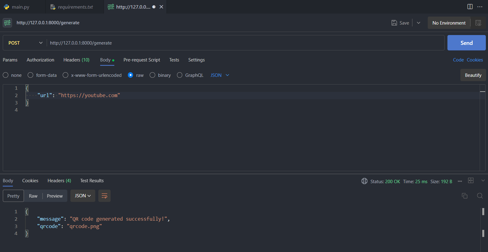
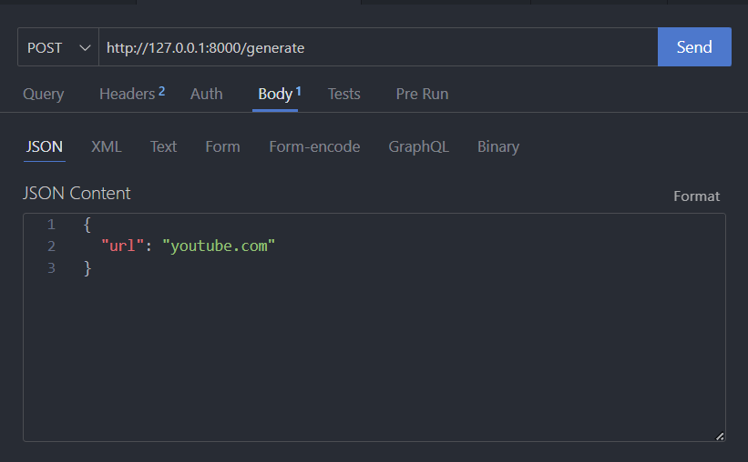

# QR CODE GENERATOR
## :rocket: Introduction 
A simple script that generates a QR code of PNG format. 
Quick Response(QR) codes are two-dimensional barcodes that can store data, such as text or a web link. 
Used FastAPI, a modern, fast (high-performance) web framework for building APIs with Python. 
We can use cURL or postman to send a POST request. Below is a screenshot of the postman vscode extension. 

## Postman VSCODE demo

## Installation

1. Fork the repository by clicking on the "Fork" button at the top right corner of this page.
2. Clone the forked repository to your local machine: `git clone https://github.com/your-username/CodeChronicle366.git`
3. Change the directory to the qr_code_generator folder: `cd qr_code_generator`
4. Create a virtual environment: `python -m venv venv`
5. Activate the virtual environment: `venv\Scripts\activate`
6. Install the required dependencies: `pip install -r requirements.txt`

## Usage/Testing if app is working
To use this script, follow these steps:
1. Run the script using `uvicorn main:app --reload`.
2. Use an API client like Postman or cURL or Thunder client (in a new tab or session) to send a POST request to http://127.0.0.1:8000/generate with a JSON body that includes the url field. 

3. The API will generate a QR code, similar to the one below, with the provided URL and save it as `qrcode.png` in `qrcodes` folder. 
4. Use a phone with a qrcode scanner to confirm it works.  

## Contributing
Contributions are welcome! If you have any ideas or improvements, feel free to submit a pull request.
If you'll want me to create a custom one with a watermark of your logo reach out and I will make it anytime I'll be free. 

## License
This project is licensed under the MIT License. See the [LICENSE](./LICENSE) file for more details.