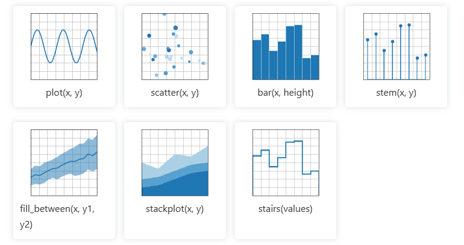

# Plot types

## :rocket: Introduction

## Data visualization with matplotlib

## Plots of pairwise(x, y), tabular(var_0,, ...,var_n), and functional f(x) = y data

## Installation

1. Fork the repository by clicking on the "Fork" button at the top right corner of this page.
2. Clone the forked repository to your local machine: `git clone https://github.com/your-username/CodeChronicle366.git`
3. Change the directory to the qr_code_generator folder: `cd data_visualization`
4. Create a virtual environment: `python -m venv .venv`
5. Activate the virtual environment: `.venv\Scripts\Activate.ps1`
6. Install the required dependencies: `pip install -r requirements.txt`

## Usage/Testing if app is working
To use this script, follow these steps:
1. Run the script using `python mpl_plot_example`.

3. The API will generate a QR code, similar to the one below, with the provided URL and save it as `qrcode.png` in `qrcodes` folder. 
4. Use a phone with a qrcode scanner to confirm it works.  

## Contributing
Contributions are welcome! If you have any ideas or improvements, feel free to submit a pull request.
If you'll want me to create a custom one with a watermark of your logo reach out and I will make it anytime I'll be free. 

## License
This project is licensed under the MIT License. See the [LICENSE](./LICENSE) file for more details.