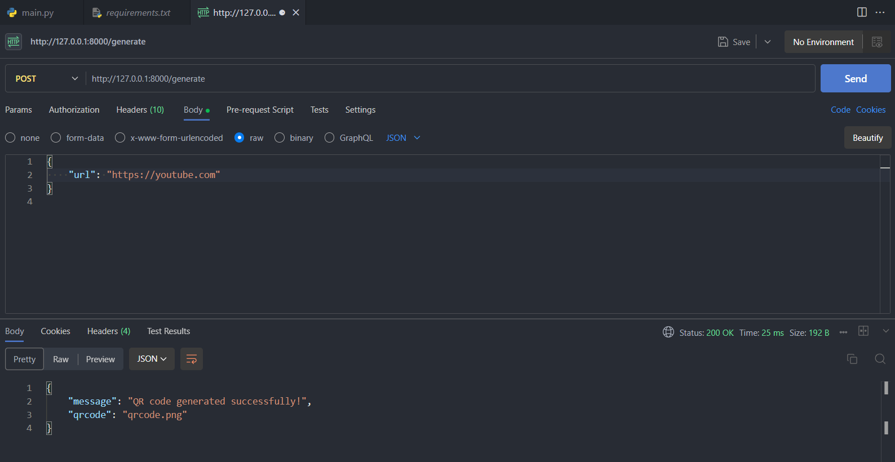

## :rocket: Introduction 
A simple script that generates a QR code of PNG format. 
Quick Response(QR) codes are two-dimensional barcodes that can store data, such as text or a web link. 
Used FastAPI, a modern, fast (high-performance) web framework for building APIs with Python. 
We can use cURL or postman to send a POST request. Below is a screenshot of the postman vscode extension. 

### Postman VSCODE demo

